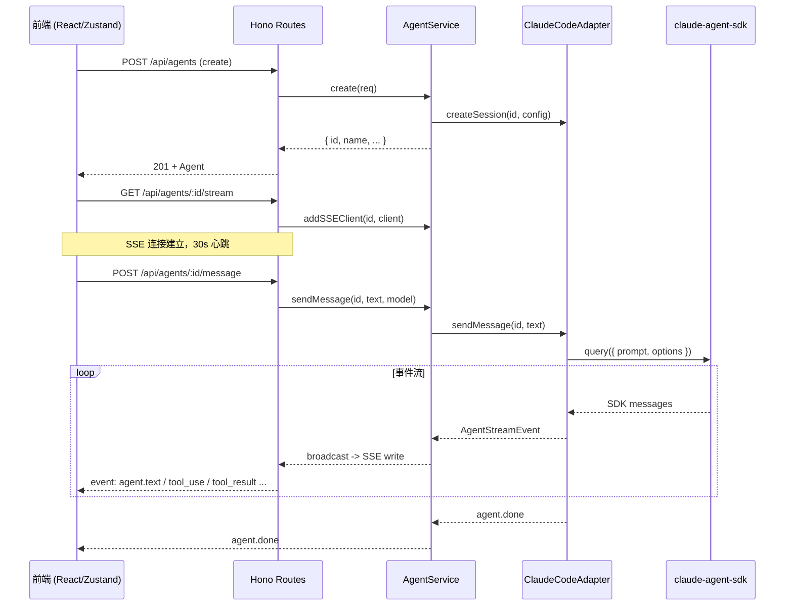

# AI Agent -- 全栈设计

## 架构概览（前后端协作）

AI Agent 是 Harnesson 的核心功能域，采用 SSE (Server-Sent Events) 实现前后端实时通信。前端通过 Zustand store 管理 Agent 生命周期，后端通过 `AgentService` 编排适配器与持久化，底层使用 `@anthropic-ai/claude-agent-sdk` 的 `query()` 函数驱动 Agent 执行。

**关键设计决策：**

- 前端仅维持一个活跃 SSE 连接，切换 Agent 时自动关闭旧连接，避免浏览器 HTTP/1.1 连接池耗尽（上限 6 个同源连接）。
- 消息队列 (`messageQueue: Promise<void>`) 确保同一 Agent 的消息按顺序处理，防止并发写入导致状态混乱。
- 消息在 `agent.done` 后整批持久化到 PostgreSQL（通过 Prisma），而非逐事件写入。

## 前端设计

**状态管理** — `useAgentStore`（Zustand）管理全部 Agent 状态：

| 状态域 | 数据结构 | 说明 |
|--------|----------|------|
| `agents` | `Agent[]` | 所有 Agent 列表 |
| `messages` | `Record<string, AgentMessage[]>` | 按 Agent ID 分组的消息历史 |
| `eventSources` | `Record<string, EventSource>` | 活跃 SSE 连接 |
| `isStreaming` | `Record<string, boolean>` | 流式传输状态 |
| `todos` | `Record<string, TodoItem[]>` | 待办事项列表 |
| `pendingQuestion` | `Record<string, PendingQuestion \| null>` | 待回答的交互式问题 |

**Agent 生命周期：**

1. **创建** — `createAgent()` 调用 `POST /api/agents`，成功后立即 `connectSSE()` 打开事件流。
2. **激活** — `activateAgent()` 从 DB 加载历史消息，恢复 pending question，连接 SSE。
3. **发送消息** — `sendMessage()` 追加用户消息到本地状态，POST 到后端，SSE 流推送回复事件。
4. **销毁** — `destroyAgent()` 调用后端清理，断开 SSE，从 store 中移除所有关联数据。

**流事件处理** — `appendStreamEvent()` 根据事件类型分流处理：
- `agent.thinking` → 设置 `isStreaming=true`，状态为 `running`
- `agent.text` → 追加文本到当前 Agent 消息的 `content` 字段
- `agent.tool_use` (TodoWrite) → 替换整个 `todos` 列表，全部完成时 1.5s 后生成快照消息
- `agent.question` → 设置 `pendingQuestion`，触发交互式问答弹窗
- `agent.done` / `agent.error` → 设置 `isStreaming=false`，更新状态

## 后端设计

**核心类 `AgentService`：**
- `runtime: Map<string, RuntimeState>` — 内存中的运行时状态，包含适配器实例、SSE 客户端集合、事件缓冲区和消息队列。
- `pendingAnswers: Map<string, { resolve, question }>` — 等待用户回答的 Promise resolver。

**适配器模式** — `ClaudeCodeAdapter` 实现 `AgentAdapter` 接口，封装 `@anthropic-ai/claude-agent-sdk`：
- `createSession` / `destroySession` — 会话生命周期
- `sendMessage` — 异步生成器，yield `AgentStreamEvent`
- `abort` — 通过 `AbortController` 中止执行
- `updateSessionModel` / `getSessionData` / `restoreSession` — 模型切换与会话恢复

**交互式问答流程** — Agent 发出 `AskUserQuestion` 工具调用时：
1. 广播 `agent.tool_use` 和 `agent.question` 事件
2. 中止当前 SDK 流
3. 设置 session 状态为 `waiting_for_input`
4. 通过 Promise 等待用户回答
5. 收到回答后广播 `agent.tool_result`，递归调用 `processStreamWithQuestions` 继续执行

## API 端点

| 方法 | 路径 | 说明 | 关键状态码 |
|------|------|------|-----------|
| `POST` | `/api/agents` | 创建 Agent 会话 | 201 |
| `GET` | `/api/agents` | 列出所有 Agent | 200 |
| `GET` | `/api/agents/:id` | 获取单个 Agent | 200 / 404 |
| `GET` | `/api/agents/:id/messages` | 获取消息历史（支持分页 `limit`/`before`） | 200 |
| `GET` | `/api/agents/:id/stream` | 建立 SSE 事件流（30s 心跳） | 200 (SSE) |
| `POST` | `/api/agents/:id/message` | 发送消息 | 202 / 409 / 500 |
| `POST` | `/api/agents/:id/abort` | 中止执行 | 200 |
| `POST` | `/api/agents/:id/tool-result` | 提交交互式问题答案 | 200 / 404 |
| `POST` | `/api/agents/:id/command` | 执行斜杠命令 (/clear, /model, etc.) | 200 / 400 |
| `DELETE` | `/api/agents/:id` | 销毁 Agent (软删除) | 200 |
| `GET` | `/api/models` | 获取支持的模型列表 | 200 |
| `GET` | `/api/slash-commands` | 获取可用斜杠命令 | 200 |

## 数据类型

**AgentStreamEvent** — SSE 事件类型联合：
- `agent.thinking` / `agent.text` — 思考状态与文本输出
- `agent.tool_use` / `agent.tool_result` — 工具调用与结果
- `agent.error` — 错误（含 `code`: SEND_ERROR / SDK_ERROR / PROCESSING_ERROR）
- `agent.done` — 完成（含 `reason`: aborted）
- `agent.question` — 交互式问题

**AgentMessage** — 消息模型：
- `role`: `user` | `agent`
- `content`: 文本内容
- `events?: AgentStreamEvent[]` — agent 消息关联的事件列表
- `todoSnapshot?: TodoItem[]` — 待办事项完成快照
- `contentBlocks?: ContentBlock[]` — 富文本内容块
- `images?: ImageAttachment[]` — 图片附件（base64 + MIME type）
