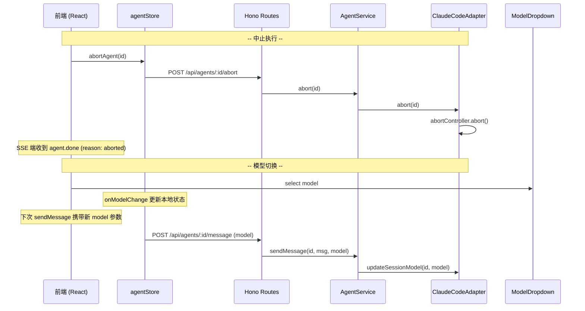

# Agent 控制 -- 全栈设计

## 架构概览（前后端协作）

Agent 控制覆盖两个核心操作：中止执行和模型切换。两者均为轻量级操作，前后端通过 REST API 交互，不依赖 SSE 通道。

## 前端设计

### 中止执行

中止操作入口位于 `RichTextInput` 右下角：当 `isStreaming` 为 `true` 时，发送按钮（ArrowUp 图标）替换为红色中止按钮（StopCircle 图标 + 红色半透明背景）。

**状态变化链：**
1. 用户点击中止按钮 → `onAbort` 回调 → `agentStore.abortAgent(id)`
2. `abortAgent` 调用 `POST /api/agents/:id/abort`
3. 后端 `abort()` 触发 `AbortController.abort()`
4. SDK 流因 `abortController.signal.aborted` 为 `true` 而 `break`
5. ClaudeCodeAdapter 的 `sendMessage` 生成器 yield `{ type: 'agent.done', reason: 'aborted' }`
6. 前端 `appendStreamEvent` 收到 `agent.done` → 设置 `isStreaming=false`，状态变为 `idle`

### 模型切换

模型选择器为 `ModelDropdown` 组件，位于输入框右下角发送按钮旁边。组件初始化时通过 `getSupportedModels()` 调用 `GET /api/models` 获取模型列表（由 ClaudeCodeAdapter 的 `query('__list_models__')` 获取）。

**交互流程：**
1. 点击模型按钮展开下拉菜单，支持自动方向检测（底部空间不足时向上弹出，`dropUp` 状态）。
2. 选中模型后通过 `onModelChange` 回调更新父组件的 `modelValue` 状态。
3. 下次发送消息时，`sendMessage` 将当前 `model` 值作为第三个参数传递。
4. 点击外部区域自动关闭下拉菜单。

**即时命令切换** — 也支持通过斜杠命令 `/model <name>` 即时切换模型。该命令由 `POST /api/agents/:id/command` 路由到 `AgentService.executeCommand()`，直接调用 `adapter.updateSessionModel()` 更新内存配置并写入数据库。

## 后端设计

### 中止实现

- **路由**: `POST /api/agents/:id/abort`，无请求体，返回 `{ status: 'aborted' }`。
- **AgentService.abort()**: 获取 runtime 中的 adapter 实例，调用 `adapter.abort(agentId)`。
- **ClaudeCodeAdapter.abort()**: 检查 `sessions` map 中该 Agent 的 `abortController`，若存在则调用 `abortController.abort()` 并置为 `null`。
- 中止不改变 session 的持久化状态（DB 中的 status），仅在内存层面停止执行。最终的 `agent.done` 事件传播到前端后，`agentStore` 将显示状态更新为 `idle`。

### 模型切换实现

- **发送时切换**: 在 `sendMessage()` 方法中，如果请求携带 `model` 参数且不为 `undefined`，则：
  1. 更新 DB: `prisma.agentSession.update({ where: { id }, data: { model } })`
  2. 更新内存: `runtime.adapter.updateSessionModel(agentId, model)`
- **命令切换**: `executeCommand('model', args)` → `adapter.updateSessionModel(agentId, args)` + DB 更新。
- **ClaudeCodeAdapter.updateSessionModel()**: 直接修改 `session.config.model` 字段，下次 `query()` 调用时通过 `sdkOptions.model` 传入 SDK。
- 模型切换仅影响后续消息，当前正在执行的 Agent 不受影响（因为 `updateSessionModel` 不中断运行中的流，且新的 `query()` 调用会使用更新后的配置）。

### 交互式问答中的中止

当 Agent 处于 `waiting_for_input` 状态（等待用户回答 `AskUserQuestion`）时，`agentService.destroy()` 会清理 pending answer：通过 `pending.resolve('')` 释放等待的 Promise，使 `processStreamWithQuestions` 收到空回答后自然结束，而不产生新的 tool_result 事件。

## 斜杠命令

除了模型切换，`executeCommand` 还支持以下内置命令：

| 命令 | 参数 | 效果 |
|------|------|------|
| `/clear` | 无 | 清空 eventBuffer（内存） |
| `/compact` | 无 | 标记上下文压缩（返回成功消息） |
| `/model` | `<name>` | 切换模型（内存 + DB） |
| `/help` | 无 | 列出可用命令 |

命令路由: `POST /api/agents/:id/command`，请求体 `{ command, args? }`，返回 `{ success, message?, error? }`。

## API 端点

| 方法 | 路径 | 说明 |
|------|------|------|
| `POST` | `/api/agents/:id/abort` | 中止 Agent 执行 |
| `POST` | `/api/agents/:id/command` | 执行斜杠命令 (/model, /clear, etc.) |
| `GET` | `/api/models` | 获取可用模型列表 |
