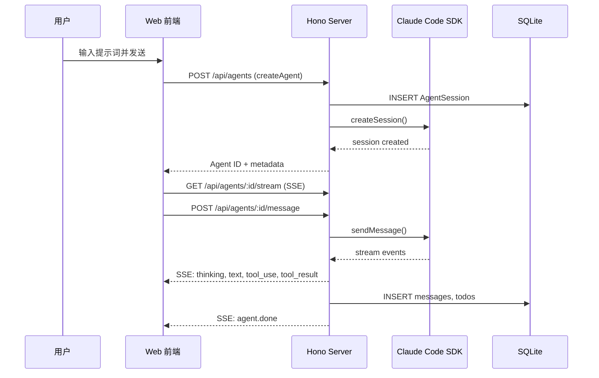

# Agent 会话管理 — 设计文档

## 架构概览

Agent 会话管理采用前后端分离架构，通过 REST API + SSE 流实现会话生命周期管理。



## 前端设计

### 组件树

```
NewSessionPage → RichTextInput (初始提示词)
              → ModelDropdown (模型选择)
              → BranchDropdown (分支选择)

Sidebar → AgentEntry (按项目分组)
        → AgentStatusDot (状态指示灯)
        → AgentContextMenu (右键菜单)

AgentPanel → AgentContextHeader (名称, 状态, 耗时, token)
           → MessageRenderer (消息历史)
           → RichTextInput (消息输入)
```

### 状态管理

使用 Zustand `agentStore` 管理：
- **agents**: Map<agentId, Agent> — Agent 运行时状态
- **activeAgentId**: 当前活跃 Agent
- **agentPanelStates**: Map<agentId, AgentPanelState> — 面板打开/最大化
- **messagesByAgent**: Map<agentId, AgentMessage[]> — 消息历史
- **streamingClients**: Map<agentId, EventSource> — SSE 连接池（仅一个活跃）

单 SSE 连接策略：同一时刻仅维持一个活跃 EventSource，避免浏览器连接池耗尽（Chrome 限制 6 个同域连接）。

## 后端设计

### API 端点

| 方法 | 路径 | 描述 |
|------|------|------|
| POST | /api/agents | 创建 Agent 会话 |
| GET | /api/agents | 列出所有 Agent |
| GET | /api/agents/:id | 获取 Agent 详情 |
| DELETE | /api/agents/:id | 删除（软删除） |
| GET | /api/agents/:id/messages | 获取消息历史 |
| GET | /api/agents/:id/stream | SSE 事件流 |
| POST | /api/agents/:id/message | 发送消息 |
| POST | /api/agents/:id/abort | 中止执行 |

### 数据库表

**AgentSession**: id, name, type, status, projectId, branch, worktreePath, cwd, model, permissionMode, config, sessionData (SDK 状态序列化), error, lastMessageAt, createdAt, updatedAt

**Message**: id, agentId, role (user/agent), content, images (JSON), contentBlocks (JSON), events (JSON), createdAt

状态枚举: idle, running, waiting, waiting_for_input, completed, error

### 会话恢复

服务启动时（`index.ts`）调用 `agentService.restoreAll()`：
1. 从 SQLite 加载所有 status 为 running/waiting/waiting_for_input 的 AgentSession
2. 通过 serialized sessionData 调用 SDK `restoreSession()`
3. 恢复成功 → 状态保持；失败 → 标记为 error

## Specification Details

Agent 会话管理是 AI 编码的核心入口。用户创建 Agent 时指定工作目录（项目路径）、AI 模型、Git 分支和权限模式。会话数据通过 SQLite 持久化，包含会话状态、消息历史和待办事项。

服务重启时自动恢复未完成的 Agent 会话。每个 Agent 通过 Claude Code SDK 管理，支持会话恢复（resume）。

侧边栏显示所有会话，未销毁的会话按项目分组。每个会话卡片显示名称、状态指示灯、分支名和模型名。

### Parameters

- Agent 会话状态包括：idle, running, waiting, waiting_for_input, completed, error
- 侧边栏 Agent 列表按项目分组，组间自动展开当前活跃项目
- Agent 面板最小宽度 320px，支持通过拖拽分隔条调整
- Agent 状态指示灯：运行中用紫色脉冲动画，完成绿色常亮，错误红色常亮
- 服务重启恢复会话时从 SQLite 读取所有 running/waiting/waiting_for_input 状态的 Agent
- 同一时刻只有一个活跃的 SSE 连接（避免浏览器连接池耗尽）

## Constraints

- Agent 创建需要后端服务正常运行且项目路径有效
- 删除 Agent 为软删除（状态设为 destroyed），历史数据保留在数据库中
- 服务重启时恢复的 Agent 需要 SDK 会话数据有效，否则标记为 error
- 不支持同时向同一 Agent 发送多条消息（需等待当前消息处理完成）
- SSE 连接仅支持单 Agent 同时活跃，多个同时流式传输需排队
