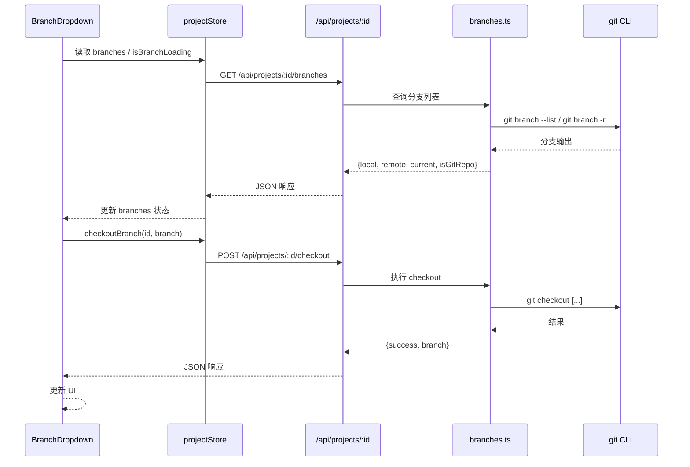

# Git 集成 — 架构概览

Git 集成功能允许用户在顶栏查看和切换当前项目的 Git 分支，支持本地分支和远程分支的展示与切换。

## 架构概览

## 前端设计

BranchDropdown 组件位于顶栏，显示 GitBranch 图标和当前分支名。点击展开下拉面板，分为 Local 和 Remote 两个区域。非 Git 项目显示 "此项目不是 Git 仓库" 提示，无分支时显示 "无分支"。使用 `mousedown` 事件监听实现点击外部关闭。

projectStore 管理 `branches`（含 local、remote、current、isGitRepo）、`isBranchLoading` 和 `checkoutBranch` 方法。

## 后端设计

branches.ts 提供两个端点。分支列表通过 `git branch --list` 和 `git branch -r` 获取，解析时识别 `* ` 前缀标记当前分支，过滤远程引用中的 `->` 符号。checkout 端点对远程分支执行 `git checkout -b <local> <remote>`，对本地分支直接 `git checkout <name>`，均设 10 秒超时。分支名经过注入防护检查（禁止换行/null字符）。

### API 端点

| 方法 | 路径 | 说明 |
|------|------|------|
| GET | `/api/projects/:id/branches` | 获取分支列表，返回 `{local, remote, current, isGitRepo}` |
| POST | `/api/projects/:id/checkout` | 切换分支，请求体 `{branch}`，返回 `{success, branch}` |
