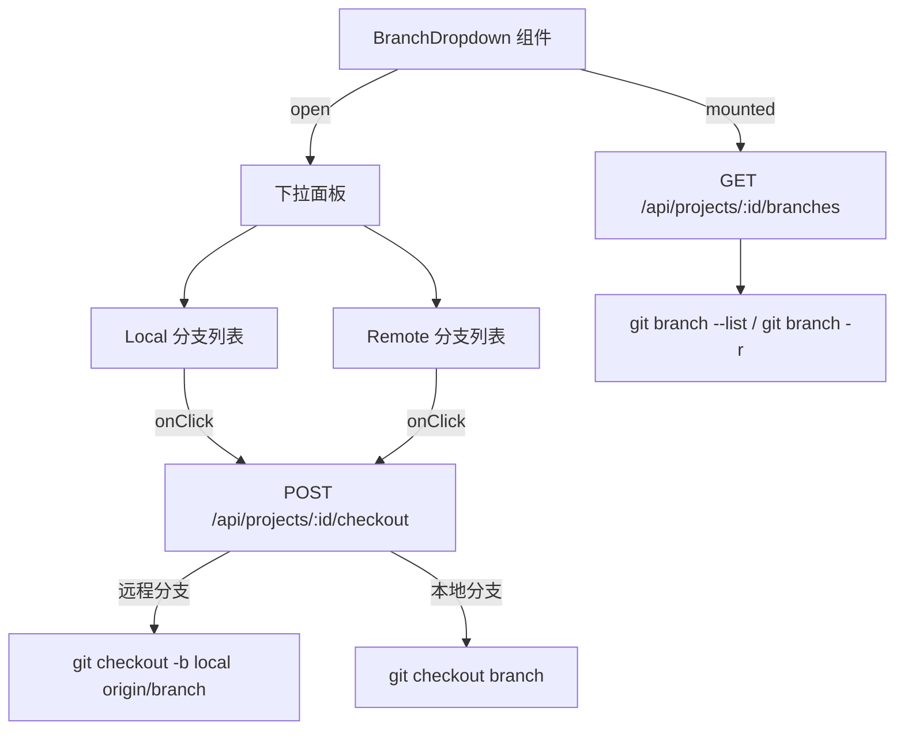

# 分支管理 — 全栈设计

分支管理功能提供 Git 分支的查看和切换能力。用户通过顶栏下拉菜单浏览所有本地和远程分支，选择任意分支即可切换，远程分支自动创建本地跟踪分支。

## 架构概览

## 前端设计

BranchDropdown 组件位于页面顶栏，使用 mousedown 事件监听实现点击外部关闭。下拉面板分为两个区域：

- **Local**：列出所有本地分支，当前分支以 harness-accent 色高亮并显示对勾图标（✓）
- **Remote**：列出所有远程分支（格式 `origin/branch-name`），显示时去除 `origin/` 前缀

选中非当前分支时调用 `doCheckout(activeProjectId, branch)`。checkout 失败时面板顶部显示红色错误提示（去除 `error:` 前缀）。非 Git 项目显示居中的 "此项目不是 Git 仓库" 提示，分支列表为空且不在 Git 仓库时不显示下拉面板。

projectStore 的 `branches` 状态结构：`{local: string[], remote: string[], current: string | null, isGitRepo: boolean}`。`checkoutBranch(id, branch)` 返回 `{success: boolean, error?: string}`。

## 后端设计

branches.ts 使用 Hono 框架，通过 Prisma 查询项目记录获取项目路径。分支列表端点并行执行 `git branch --list` 和 `git branch -r`（各 10 秒超时），解析 `* ` 前缀识别当前分支，过滤包含 `->` 的远程引用行。

checkout 端点对分支名做注入防护检查（正则 `/[\n\r\0]/`），远程分支（以 `origin/` 开头）执行 `git checkout -b <localName> <remoteName>` 自动创建本地跟踪分支，本地分支直接 `git checkout <localName>`。失败时提取 stderr 信息返回给前端。

### API 端点

| 方法 | 路径 | 请求/响应 |
|------|------|-----------|
| GET | `/api/projects/:id/branches` | 响应：`{local: string[], remote: string[], current: string \| null, isGitRepo: boolean}` |
| POST | `/api/projects/:id/checkout` | 请求：`{branch: string}`；响应：`{success: boolean, branch?: string, error?: string}` |

## Specification Details

### Parameters

- 分支列表返回格式：`{ local: string[], remote: string[], current: string, isGitRepo: boolean }`
- 当前分支在下拉菜单中以强调色高亮并显示对勾图标
- 分支切换通过 POST `/api/projects/:id/checkout` 完成
- 非 Git 项目不显示分支下拉菜单

## Constraints

- 仅对包含 .git 目录的项目可用（需通过 git 命令操作）
- 切换分支前建议用户保存当前工作（无自动 stash 处理）
- checkout 失败时返回错误信息，不自动回退
- 大型仓库的分支列表获取可能有短暂延迟
