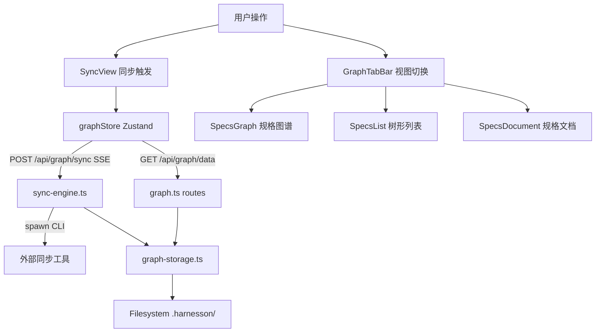

# 项目知识图谱 — 架构概览

知识图谱功能通过外部同步工具扫描代码仓库，生成结构化的规格图谱（specs）和架构图谱（architect），前端以交互式可视化图、树形列表和 Markdown 文档三种方式呈现。

## 架构概览

前端使用 React Flow + Dagre 渲染自上而下的有向无环图，三种节点类型（project / domain / feature）以不同颜色区分。图谱数据通过 graphStore（Zustand）统一管理，支持规格图谱、架构图谱、列表视图和文档视图四种标签页切换，无需重新加载数据。

## 后端设计

后端基于 Hono 路由框架，核心模块包括：

- **graph-storage.ts**：管理 `.harnesson/` 目录下的文件存储。支持 project（项目目录）和 user（`~/.harnesson/<name>/`）两种存储位置。数据包括 manifest.json、specs（graph.json / list.json / document.md / graph-summary.md）和 architect（graph.json / document.md / graph-summary.md）。
- **sync-engine.ts**：通过 `spawn()` 启动外部 CLI 工具执行同步，标准输出以 JSON 行协议传输进度事件，由 activeSyncs Map 确保同一项目路径同时只有一个活跃同步。
- **routes/graph.ts**：提供 7 个 API 端点，包括状态检查、数据获取、SSE 同步、取消同步和历史版本查询。

### API 端点

| 方法 | 路径 | 说明 |
|------|------|------|
| GET | `/api/graph/status` | 检查图谱数据是否存在，对比 commit 判断是否需要重新同步 |
| GET | `/api/graph/manifest` | 获取 manifest.json |
| GET | `/api/graph/data` | 获取完整图谱数据（manifest + specs + architect） |
| GET | `/api/graph/history` | 列出所有历史同步版本 |
| GET | `/api/graph/history/:timestamp` | 获取指定历史版本数据 |
| POST | `/api/graph/sync` | 启动 SSE 流式同步 |
| POST | `/api/graph/sync/cancel` | 取消活跃同步 |
