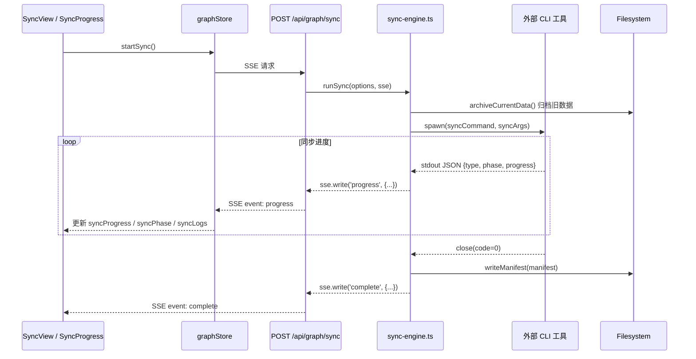

# 图谱同步 — 全栈设计

图谱同步功能触发外部 CLI 工具扫描项目代码，通过 SSE 流实时推送同步进度到前端。同步前自动归档现有数据，完成后写入 manifest.json 记录同步状态和 commit 信息。

## 架构概览

## 前端设计

SyncView 组件为同步入口，包含存储位置选择（project / user）和开始同步按钮。同步进行中显示 SyncProgress 组件，展示阶段标签、进度百分比条和实时日志。进度条分为 Init → Scan → Analyze → Generate → Done 五个里程碑。底部提供 Cancel Sync 按钮，调用 `cancelSync()` 发送 POST `/api/graph/sync/cancel`。

graphStore 管理 `syncProgress`、`syncPhase`、`syncLogs` 等状态，通过 EventSource 或 fetch SSE 接收服务端推送的 progress 事件。

## 后端设计

sync-engine.ts 是核心同步编排器。通过 `process.env.HARNESSON_SYNC_COMMAND` 和 `HARNESSON_SYNC_ARGS` 配置外部 CLI 路径和参数。activeSyncs Map 确保同一项目路径同时只能有一个活跃同步，新的同步请求直接返回 error 事件。

CLI 进程通过 stdout 输出 JSON 行协议：`{"type":"progress","phase":"scanning","progress":30,"message":"..."}`。非 JSON 行被截断为 200 字符作为普通日志。进程退出码非 0 时向 SSE 发送 error 事件。同步结束时通过 `git rev-parse HEAD` 获取当前 commit 写入 manifest.lastSyncCommit 用于后续变更检测。

### API 端点

| 方法 | 路径 | 说明 |
|------|------|------|
| POST | `/api/graph/sync` | 启动 SSE 流式同步，请求体 `{projectPath, storageLocation?, syncType?}` |
| POST | `/api/graph/sync/cancel` | 取消活跃同步，请求体 `{projectPath}` |

## Specification Details

### Parameters

- 同步阶段：initializing → scanning → analyzing → generating → completing
- 同步进度通过 SSE 事件 `progress` 传输，包含 phase、percentage、log 字段
- 存储位置可选 project（项目目录 .harnesson/）或 user（~/.harnesson/<name>/）
- 同步过程中禁止对同一项目路径发起第二个同步请求
- manifest.json 记录 lastSyncCommit 用于检测是否需要重新同步

## Constraints

- 同步需要 HARNESSON_SYNC_COMMAND 环境变量配置了有效的 CLI 工具路径
- 同一项目路径同时只能有一个活跃的同步操作
- 同步取消后无法恢复进度，需重新开始
- 同步 CLI 进程崩溃时前端收到 error 事件并显示错误信息
- 历史数据归档最多保留所有历史版本（无自动清理策略）
