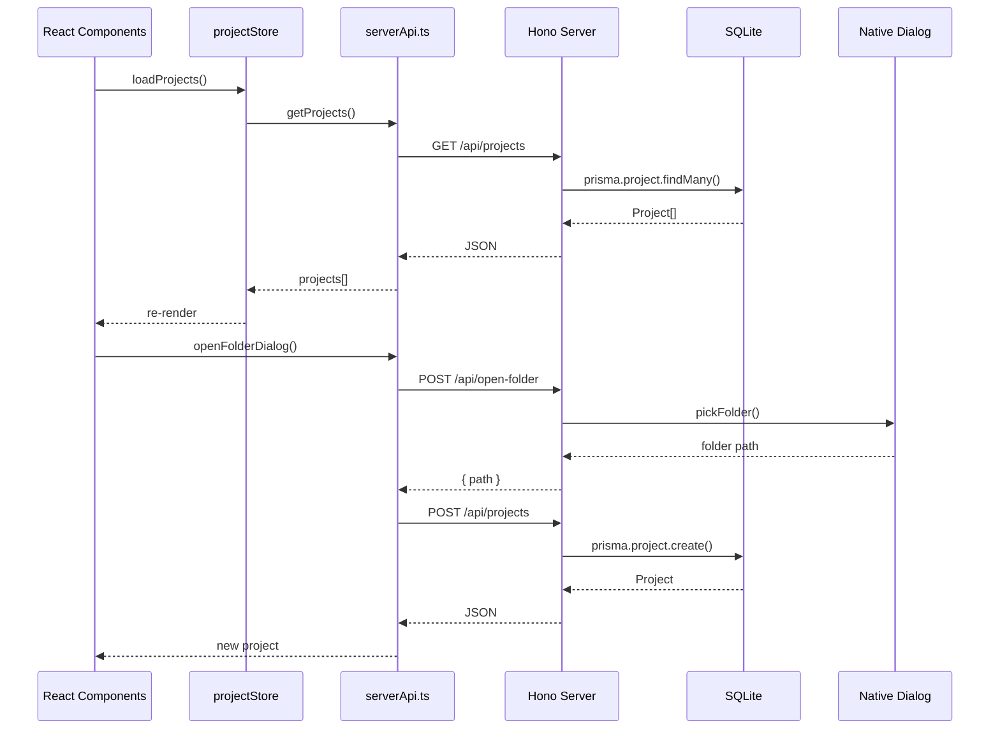
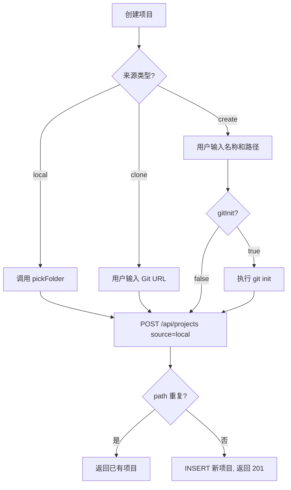

# 项目管理 - 全栈设计

## 架构概览

项目管理模块提供 Harnesson 中项目实体的全生命周期管理。前端通过 Zustand store (`projectStore`) 维护项目列表状态，通过 `serverApi.ts` 中的函数向后端发起 REST 请求。后端使用 Hono 路由处理器对接 SQLite 数据库，并提供原生 OS 文件夹选择器集成。



## 前端设计

### 路由

| 路径 | 页面组件 | 说明 |
|------|----------|------|
| `/projects` | `ProjectsPage` | 项目管理主页，列表为空时显示 EmptyState，非空时显示 ProjectList |

### 组件树

```
ProjectsPage
  ├── EmptyState (projects.length === 0)
  │     └── ActionCard × 3 (打开文件夹 / 克隆仓库 / 创建项目)
  └── ProjectList (projects.length > 0)
        ├── Search Input (搜索过滤)
        ├── View Toggle (卡片 / 列表)
        ├── Add Menu (下拉菜单：3 种创建方式)
        ├── ProjectCard[] (卡片网格) 或 ProjectRow[] (列表行)
        ├── ProjectDetailModal
        ├── CloneRepoModal
        └── CreateProjectModal
```

侧边栏布局中还有 `ProjectDropdown` 组件，用于全局项目切换，同样包含搜索和快速创建入口。

### 状态管理

`useProjectStore` (Zustand) 管理以下状态：

| 字段 | 类型 | 说明 |
|------|------|------|
| `projects` | `Project[]` | 当前项目列表 |
| `activeProjectId` | `string \| null` | 当前活跃项目 ID |
| `viewMode` | `'card' \| 'list'` | 视图模式，值持久化到 `localStorage`（key: `harnesson_view_mode`） |
| `searchQuery` | `string` | 搜索关键词 |
| `isLoading` | `boolean` | 加载状态 |

搜索过滤逻辑：同时匹配项目名称和路径（`name.toLowerCase().includes(q) || path.toLowerCase().includes(q)`），无 debounce 延迟。

## 后端设计

### API 设计

| 方法 | 路径 | 请求体 | 响应体 | 说明 |
|------|------|--------|--------|------|
| `GET` | `/api/projects` | - | `Project[]` | 按 `updatedAt` 降序获取所有项目 |
| `GET` | `/api/projects/:id` | - | `Project \| { error }` | 获取单个项目详情 |
| `POST` | `/api/projects` | `{ name, path, description?, source, gitInit? }` | `Project \| { error }` | 创建项目，路径重复时返回已有项目 |
| `DELETE` | `/api/projects/:id` | - | `{ success } \| { error }` | 删除项目（仅移除数据库记录） |
| `POST` | `/api/open-folder` | - | `{ path } \| { cancelled } \| { error }` | 调用操作系统文件夹选择器 |

### 数据库表结构

```sql
-- Project 表 (Prisma Model)
CREATE TABLE Project (
  id          TEXT PRIMARY KEY DEFAULT (uuid()),
  name        TEXT NOT NULL,
  path        TEXT NOT NULL UNIQUE,
  description TEXT,
  source      TEXT DEFAULT 'local',   -- 'local' | 'clone' | 'create'
  agentCount  INTEGER DEFAULT 0,
  createdAt   DATETIME DEFAULT CURRENT_TIMESTAMP,
  updatedAt   DATETIME
);
```

`path` 字段有唯一约束（`@unique`），确保同一路径不能重复注册。

### 业务流程


