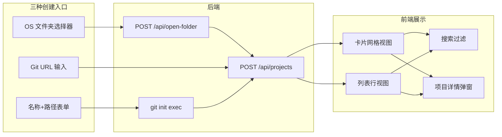

# 项目工作区 - 全栈设计

## 架构概览

项目工作区实现项目的创建、浏览、搜索和删除功能。用户通过三种入口添加项目：通过原生文件夹对话框选择已有目录（source=local）、克隆远程 Git 仓库（source=clone）、填写表单创建空白项目（source=create，可选 `git init`）。所有项目信息存储在 SQLite 中，前端通过 Zustand store 维护列表状态，支持卡片网格和列表行两种视图模式的实时切换，以及按名称/路径的即时搜索过滤。



## 前端设计

### 视图切换

项目列表支持两种视图，通过 `viewMode` 状态控制，该值在 `localStorage` 中持久化（key: `harnesson_view_mode`），刷新页面后保持用户偏好。

- **卡片视图（card）**：`grid-cols-[repeat(auto-fill,minmax(280px,1fr))]` 的响应式网格，每张卡片展示项目名称、路径、更新时间，hover 时显示操作菜单（查看详情、打开文件夹、移除）
- **列表视图（list）**：紧凑的单列行式布局，鼠标悬停时行内显示操作按钮组

两种视图共享相同的项目数据源和右键操作逻辑。

### 搜索过滤

搜索框实时过滤，无 debounce 延迟。过滤目标同时覆盖 `name` 和 `path` 两个字段：

```ts
const filtered = useMemo(() => {
  if (!searchQuery.trim()) return projects;
  const q = searchQuery.toLowerCase();
  return projects.filter(
    (p) => p.name.toLowerCase().includes(q) || p.path.toLowerCase().includes(q)
  );
}, [projects, searchQuery]);
```

当搜索结果为空时，显示"未找到匹配的项目"提示。

### 三大创建入口

| 入口 | 触发方式 | 前端组件 | 后端涉及接口 |
|------|----------|----------|-------------|
| 打开文件夹 | 点击按钮 / 拖拽文件夹 | `EmptyState` → `openFolder` | `POST /api/open-folder` → `POST /api/projects` |
| 克隆仓库 | 点击按钮打开弹窗 | `CloneRepoModal` → `cloneRepo` | `POST /api/projects` |
| 创建项目 | 点击按钮打开弹窗 | `CreateProjectModal` → `createProject` | `POST /api/projects`（可选 git init） |

### 拖拽支持

`EmptyState` 组件支持通过拖拽文件夹到页面来注册项目。通过 `onDragEnter` / `onDragOver` / `onDragLeave` / `onDrop` 事件处理，读取 `dataTransfer.items` 中的目录信息（`webkitGetAsEntry`），获取文件夹路径后调用 `openProjectWithPath` 注册。

### 项目删除

删除操作需要二次确认，防止误操作：
1. 首次点击"移除"，按钮文案变为"确认移除？"（红色高亮），同时启动 3 秒倒计时
2. 3 秒内再次点击则执行删除，超时则恢复初始状态
3. 详情弹窗中同样采用此二次确认机制

## 后端设计

### API 设计

| 方法 | 路径 | 请求参数 | 响应 | 状态码 |
|------|------|----------|------|--------|
| `GET` | `/api/projects` | - | `Project[]` | 200 |
| `GET` | `/api/projects/:id` | `:id` - 项目 UUID | `Project` 或 `{ error }` | 200 / 404 |
| `POST` | `/api/projects` | `{ name, path, description?, source, gitInit? }` | `Project` 或 `{ error }` | 201 / 400 |
| `DELETE` | `/api/projects/:id` | `:id` - 项目 UUID | `{ success }` 或 `{ error }` | 200 / 404 |
| `POST` | `/api/open-folder` | - | `{ path }`, `{ cancelled }` 或 `{ error }` | 200 / 500 |

### 创建项目逻辑

```
POST /api/projects
├── 校验 name 和 path 必填
├── 检查 path 是否已存在（唯一约束）
│   └── 存在则直接返回已有项目（去重）
├── 如果 source=create 且 gitInit=true
│   └── 执行 execSync(`git init "${path}"`)，失败不阻塞创建
└── INSERT 新记录，返回 201
```

### 原生文件夹选择器

`pickFolder()` 按平台分发：

| 平台 | 实现方式 |
|------|----------|
| macOS | `osascript` 调用 AppleScript `choose folder` |
| Linux | `zenity --file-selection --directory` |
| Windows | PowerShell 调用 `System.Windows.Forms.FolderBrowserDialog` |

超时时间 300 秒（5 分钟），用户取消时返回 `null`。

## Specification Details

项目工作区是用户管理编码项目的入口。支持三种项目来源：

1. **创建空白项目**：用户指定名称和路径，系统在路径下创建目录（可选执行 `git init`）
2. **克隆远程仓库**：用户提供 Git URL 和目标路径，系统记录为 clone 来源的项目
3. **打开本地文件夹**：调用操作系统原生文件夹选择器，将已有目录注册为项目

项目列表默认以卡片网格展示，每张卡片显示项目名称、路径、来源标签和 Agent 数量。用户可以切换到列表视图查看更紧凑的行式布局。搜索框支持按名称和路径的实时过滤。

### Parameters

- 项目卡片网格布局，每行自适应列数，卡片间距 12px（`gap-4` 对应 16px，实际视觉间距由 card 自身的 padding 和 gap 共同决定）
- 搜索输入即时过滤，无 debounce 延迟
- 项目删除需二次确认（点击删除按钮 → 3 秒内再次点击确认删除）
- 列表视图模式选择自动持久化到 `localStorage`（key: `harnesson_view_mode`）
- 最多支持的项目数量无硬性限制（受 SQLite 性能约束）

## Constraints

- 同一路径只能注册为一个项目（重复路径创建返回已有项目，不会插入新记录）
- 删除项目仅从数据库中移除记录，不删除磁盘上的实际文件
- 文件夹选择器在无 GUI 环境（如纯终端 Linux）下不可用 —— `zenity` 在无 X11/Wayland 时会失败
- Git 克隆失败时显示错误信息（前端捕获异常后显示"克隆失败，请检查仓库地址"），不创建项目记录
- 项目路径不存在时仍可创建记录，不会在创建时校验路径有效性
