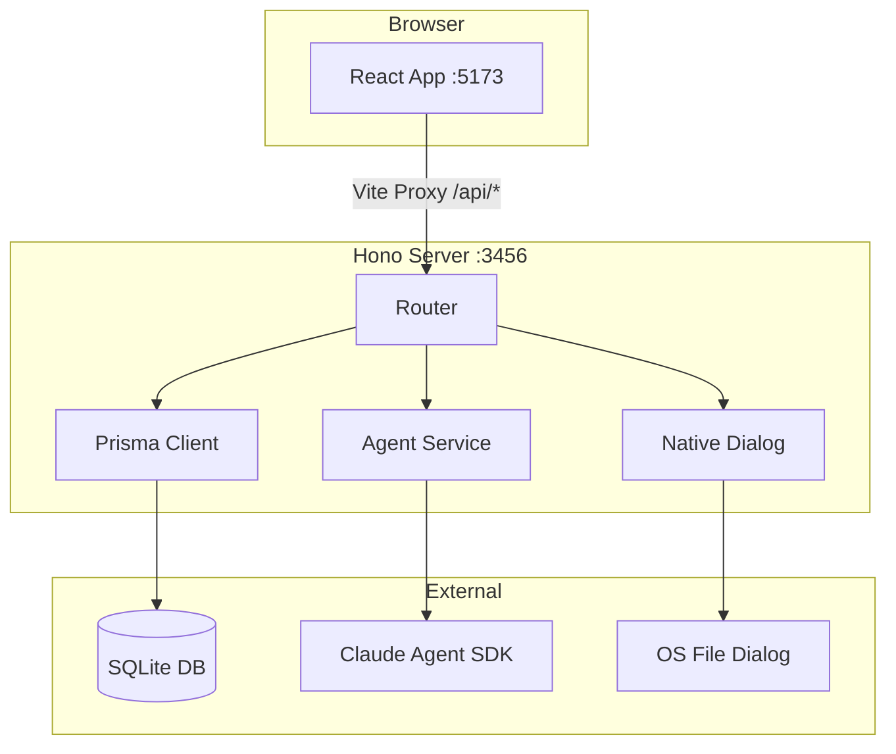

# Harnesson - 项目架构

## 技术栈

| 层级 | 技术 | 版本 |
|------|------|------|
| 前端框架 | React | 19.x |
| 路由 | React Router | 7.x |
| 样式 | Tailwind CSS | 4.x |
| 状态管理 | Zustand | 5.x |
| 构建工具 | Vite | 6.x |
| 后端框架 | Hono | 4.x |
| ORM | Prisma | 7.x |
| 数据库 | SQLite (better-sqlite3) | 12.x |
| AI SDK | @anthropic-ai/claude-agent-sdk | 0.2.x |
| 图形可视化 | @xyflow/react + @dagrejs/dagre | 12.x / 3.x |
| 包管理 | pnpm workspace | 11.x |
| 语言 | TypeScript | 5.7.x |
| 运行时 | Node.js + tsx | 22.x |

## 设计原则

- **Monorepo 共享类型**：前后端通过 `packages/shared` 共享接口定义（Project、AgentSession 等类型），避免重复定义
- **RESTful API**：后端以 Hono 路由组织，API 路径统一为 `/api/*` 前缀
- **客户端状态驱动**：前端使用 Zustand store 管理全局状态（项目列表、Agent 会话），通过 `serverApi.ts` 单一模块封装所有后端调用
- **原生集成**：文件夹选择等系统级操作通过后端调用原生 OS 对话框（AppleScript / Zenity / PowerShell）

## 编码规范

- TypeScript strict 模式，ES2020 目标
- 模块系统：ESM（`"type": "module"`）
- 路径别名：前端 `@/` 映射到 `src/`，后端使用 `.js` 扩展名的相对导入
- 组件文件使用 PascalCase，工具库使用 camelCase
- CSS 使用 Tailwind 4 的 `@harnesson/web` 自定义主题变量

## 架构图



## 项目结构

```
harnesson/
  apps/
    web/src/
      pages/           # 路由页面 (ProjectsPage, NewSessionPage, GraphPage, TasksPage, FilesPage, GitPage)
      components/      # UI 组件
        layout/        # MainLayout, ProjectDropdown
        projects/      # ProjectCard, ProjectList, CreateProjectModal, CloneRepoModal...
      stores/          # Zustand stores (projectStore, agentStore, ...)
      hooks/           # useProjectActions, useAgentActions, ...
      lib/             # 工具函数与 API 封装 (serverApi.ts, utils.ts)
    server/src/
      index.ts         # Hono 服务器入口
      routes/          # 路由模块 (projects, agents, graph, branches, open-folder, health)
      lib/             # 基础设施 (prisma, agent-service, native-dialog, find-port)
      generated/       # Prisma Client 生成代码
    server/prisma/
      schema.prisma    # 数据库模型定义
  packages/
    shared/src/
      types/           # Project, AgentSession, GraphFullData, ContentBlock 等共享类型
```

## 关键模块

| 模块 | 前端入口 | 后端路由 | 功能 |
|------|----------|----------|------|
| 项目管理 | `ProjectsPage` | `/api/projects`, `/api/open-folder` | 项目的创建、浏览、搜索、删除 |
| AI Agent | `NewSessionPage` | `/api/agents`, `/api/models` | Agent 会话创建、消息收发、工具执行 |
| 知识图谱 | `GraphPage` | `/api/graph/*` | 代码关系图谱可视化 |
| Git 管理 | `GitPage` | `/api/projects/:id/branches`, `/api/projects/:id/checkout` | 分支查看与切换 |
| 任务管理 | `TasksPage` | (Agent 内部的 TodoItem) | Agent 执行中的 TODO 条目展示 |

## 部署架构

- **开发环境**：`pnpm dev` 并行启动 Vite (5173) 和 Hono (3456)，Vite 将 `/api/*` 请求代理到后端
- **构建流程**：`pnpm build` 依次编译 shared 包和 web 应用，server 使用 tsx 直接运行
- **数据持久化**：单文件 SQLite 数据库，由 Prisma 迁移管理
- **端口发现**：server 在首选端口被占用时自动查找可用端口
