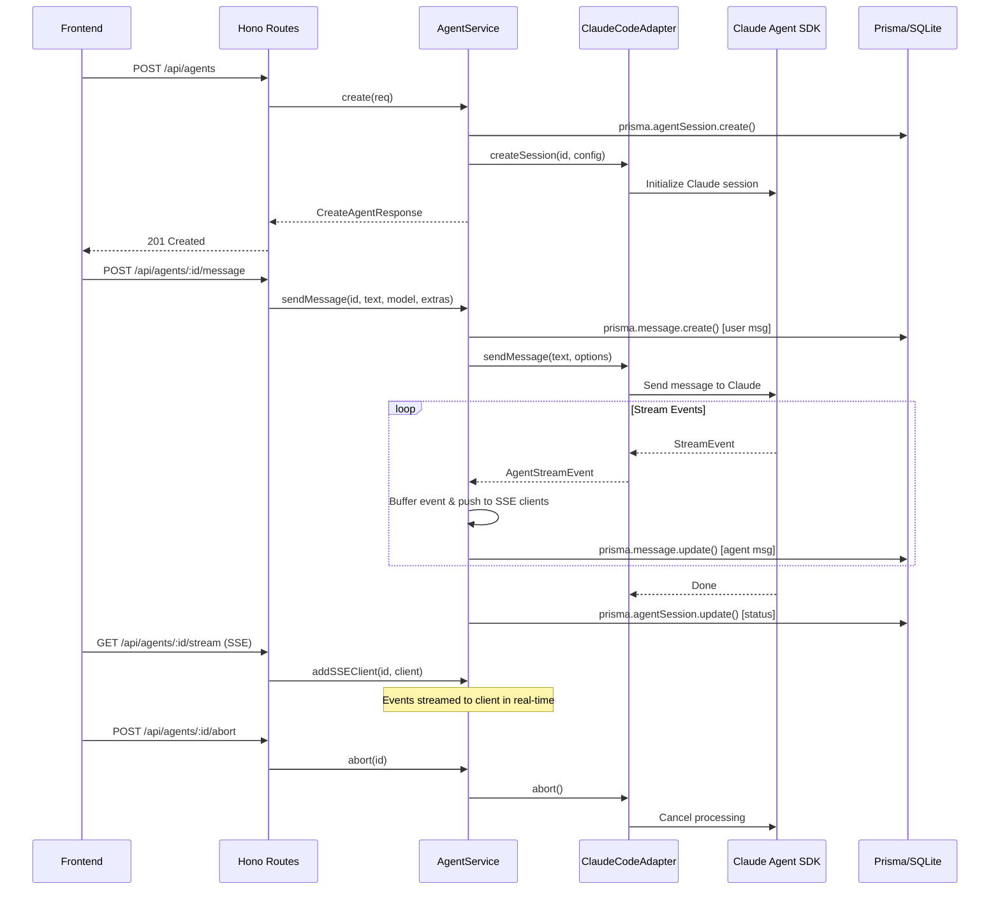

# AI Agent — Design Specification

## Overview

The AI Agent module provides a full-stack chat interface for interacting with Claude Code agents. Users can create agent sessions, send messages with text and images, receive streamed responses via SSE, view tool executions, manage todos, and control agent execution (abort, model switch). The backend uses the Claude Agent SDK to orchestrate agent sessions.

---

## Frontend Design

### Pages

#### NewSessionPage (`apps/web/src/pages/NewSessionPage.tsx`)

Landing page for creating a new agent session. Prompts the user to configure session parameters before spawning an agent.

### Components

#### AgentPanel (`apps/web/src/components/layout/AgentPanel.tsx`)

Main agent chat container. Orchestrates all sub-components within a resizable panel:

- **AgentContextHeader**: Shows agent name, branch, model, status dot, and context menu
- **MessageRenderer**: Renders the scrollable message list
- **ThinkingBar**: Displays agent thinking progress bar
- **TodoBar**: Shows current agent todo items
- **AskUserQuestionPanel**: Renders when agent has a pending question requiring user input
- **RichTextInput**: Multi-line input with image upload support
- Supports maximized and normal (440px default) width modes
- Auto-scrolls to bottom on new messages with manual scroll-up detection

#### AgentContextHeader (`apps/web/src/components/layout/AgentContextHeader.tsx`)

Header bar displaying:
- Agent name and type
- Current git branch (via `BranchDropdown`)
- Model selector (via `ModelDropdown`)
- Status indicator (via `AgentStatusDot`)
- Context menu (via `AgentContextMenu`) with actions: abort, destroy, model switch

#### MessageRenderer (`apps/web/src/components/chat/MessageRenderer.tsx`)

Renders the message timeline with:
- User messages (text + images)
- Agent text responses (rendered as Markdown with syntax highlighting)
- Tool execution cards (from `tool-cards/` directory)
- Thinking indicators (`ThinkingIndicator`)
- Todo snapshots (`TodoBar`)

#### RichTextInput (`apps/web/src/components/chat/RichTextInput.tsx`)

Multi-line text input supporting:
- Plain text entry with Shift+Enter for newlines, Enter to send
- Image paste (clipboard) and file upload
- Image preview thumbnails before sending
- Slash command autocomplete (`SlashCommandPopup`)
- Disabled state during streaming

#### SlashCommandPopup (`apps/web/src/components/chat/SlashCommandPopup.tsx`)

Autocomplete popup triggered by `/` input:
- Lists available slash commands from `GET /api/slash-commands`
- Filters commands as user types
- Supports builtin and skill command types
- Selected command is sent via `POST /api/agents/:id/command`

#### Tool Cards (`apps/web/src/components/chat/tool-cards/`)

Specialized card components for rendering tool execution results:
- Each card shows tool name, input, output, duration, and status
- Expandable/collapsible detail sections
- Error state handling

#### AskUserQuestionPanel (`apps/web/src/components/chat/AskUserQuestionPanel.tsx`)

Displayed when the agent asks a question:
- Renders question text and options
- Supports single-select and multi-select modes
- Submits answer via `POST /api/agents/:id/tool-result`

### State Management

#### agentStore (`apps/web/src/stores/agentStore.ts`)

Zustand store managing:
- `agents`: Map of agent info records
- `messages`: Map of agent ID to message arrays
- `isStreaming`: Map of agent ID to streaming state
- `todos`: Map of agent ID to todo item arrays
- `pendingQuestion`: Map of agent ID to question data
- Actions: `sendMessage`, `abortAgent`, `updateAgent`, `appendStreamEvent`, `loadMessages`, `loadTodos`

#### slashCommandStore (`apps/web/src/stores/slashCommandStore.ts`)

Zustand store managing:
- `commands`: Array of available slash commands
- Actions: `loadCommands`

---

## Backend Design

### API Endpoints

| Method | Endpoint | Description |
|---|---|---|
| GET | `/api/models` | List available Claude models |
| POST | `/api/agents` | Create a new agent session |
| GET | `/api/agents` | List all agent sessions |
| GET | `/api/agents/:id` | Get single agent session |
| GET | `/api/agents/:id/messages` | Get message history (paginated) |
| GET | `/api/agents/:id/todos` | Get agent todo items |
| POST | `/api/agents/:id/message` | Send a message to the agent |
| POST | `/api/agents/:id/tool-result` | Submit answer to a pending question |
| GET | `/api/agents/:id/stream` | SSE stream for real-time events |
| POST | `/api/agents/:id/abort` | Abort current processing |
| POST | `/api/agents/:id/command` | Execute a slash command |
| DELETE | `/api/agents/:id` | Destroy an agent session |
| GET | `/api/slash-commands` | List available slash commands |

### Endpoint Details

#### `POST /api/agents`

Creates a new agent session. Validates `cwd` as an absolute path, resolves the associated project, initializes a Claude Code adapter session, detects the current git branch, and persists the session to the database.

**Request Body:**

| Field | Type | Required | Description |
|---|---|---|---|
| `cwd` | string | yes | Absolute working directory |
| `type` | string | yes | Agent type (e.g. `"claude-code"`) |
| `model` | string | no | Model override |
| `systemPrompt` | string | no | Custom system prompt |
| `permissionMode` | string | yes | `"auto"` or `"manual"` |
| `maxTurns` | number | no | Maximum conversation turns (default: 50) |
| `prompt` | string | no | Initial prompt (used for session naming) |

**Response:** `201 Created` with `CreateAgentResponse`.

#### `POST /api/agents/:id/message`

Sends a user message to the agent. The message is queued and processed asynchronously. Stream events are delivered via the SSE endpoint.

**Request Body:**

| Field | Type | Required | Description |
|---|---|---|---|
| `message` | string | yes* | Text message content |
| `model` | string | no | Model override for this message |
| `images` | ImageAttachment[] | no | Attached images |
| `contentBlocks` | ContentBlock[] | no | Mixed content blocks |

*At least one of `message` or `contentBlocks` must be non-empty.

**Response:** `202 Accepted` with `{ status: "accepted" }`, or `409 Conflict` if already processing.

#### `GET /api/agents/:id/stream`

SSE endpoint that streams agent events in real-time:
- Event types: `agent.thinking`, `agent.text`, `agent.tool_use`, `agent.tool_result`, `agent.error`, `agent.done`, `agent.question`
- Heartbeat every 30 seconds
- Client disconnect triggers cleanup

#### `POST /api/agents/:id/abort`

Aborts the agent's current processing loop. Safe to call at any time.

#### `POST /api/agents/:id/tool-result`

Submits an answer to a pending question asked by the agent (e.g., via `AskUserQuestionPanel`). Resolves the pending promise in the agent service, allowing the agent to continue.

**Request Body:**

| Field | Type | Required | Description |
|---|---|---|---|
| `answer` | string \| string[] | yes | User's answer (single or multi-select) |

### Agent Service Architecture



### Agent Service (`apps/server/src/lib/agent-service.ts`)

Core class managing the agent lifecycle:

- **Runtime State**: In-memory `Map<string, RuntimeState>` tracking active adapters, SSE clients, event buffers, and message queues per agent
- **Session Creation**: Resolves project by path, initializes adapter with config (cwd, model, systemPrompt, allowedTools, maxTurns), detects git branch, persists to DB
- **Message Processing**: Queues messages sequentially via `Promise` chain, buffers stream events, updates DB
- **SSE Management**: Tracks connected clients per agent, broadcasts events, handles heartbeat and disconnect cleanup
- **Question Handling**: Stores pending question promises, resolves on `submitAnswer()`
- **Auto-permission Mode**: When `permissionMode === "auto"`, pre-approves tools: `Read`, `Write`, `Edit`, `Bash`, `LSP`, `Glob`, `Grep`, `Agent`

### Claude Code Adapter (`apps/server/src/lib/claude-code-adapter.ts`)

Implements `AgentAdapter` interface, wrapping the `@anthropic-ai/claude-agent-sdk`:

- Manages individual Claude Code sessions
- Translates between the agent service's event model and the SDK's streaming API
- Handles session data persistence and restoration

### Data Model

#### Prisma Schema — AgentSession

```prisma
model AgentSession {
  id             String    @id @default(uuid())
  name           String
  type           String
  status         String    @default("idle")
  projectId      String
  branch         String    @default("main")
  worktreePath   String?
  cwd            String
  model          String?
  permissionMode String    @default("auto")
  config         String    @default("{}")
  sessionData    String?
  error          String?
  lastMessageAt  DateTime?
  createdAt      DateTime  @default(now())
  updatedAt      DateTime  @updatedAt

  project        Project   @relation(fields: [projectId], references: [id])
  messages       Message[]
  todos          TodoItem[]

  @@index([projectId])
  @@index([status])
  @@index([updatedAt])
}
```

#### Prisma Schema — Message

```prisma
model Message {
  id        String   @id @default(uuid())
  agentId   String
  role      String
  content   String   @default("")
  images       String?   // JSON serialized ImageAttachment[]
  contentBlocks String?  // JSON serialized ContentBlock[]
  events    String?
  createdAt DateTime @default(now())

  agent     AgentSession @relation(fields: [agentId], references: [id], onDelete: Cascade)

  @@index([agentId, createdAt])
}
```

#### Prisma Schema — TodoItem

```prisma
model TodoItem {
  id          String    @id @default(uuid())
  agentId     String
  subject     String
  description String?
  status      String    @default("pending")
  activeForm  String?
  createdAt   DateTime  @default(now())
  completedAt DateTime?

  agent       AgentSession @relation(fields: [agentId], references: [id], onDelete: Cascade)

  @@index([agentId])
}
```

---

## Implementation Notes

- **Sequential Message Queue**: Messages to the same agent are processed sequentially using a `Promise` chain to prevent race conditions.
- **SSE Event Buffering**: Events are buffered in memory so newly connected SSE clients can receive recent history.
- **Heartbeat**: SSE connections receive a heartbeat every 30 seconds to prevent proxy/load-balancer timeout.
- **Session Naming**: Agent names are auto-generated from the first 12 characters of the initial prompt.
- **Path Validation**: All `cwd` parameters are validated as absolute paths with no `..` traversal.
- **Cascade Delete**: Deleting an agent session cascades to its messages and todo items.
