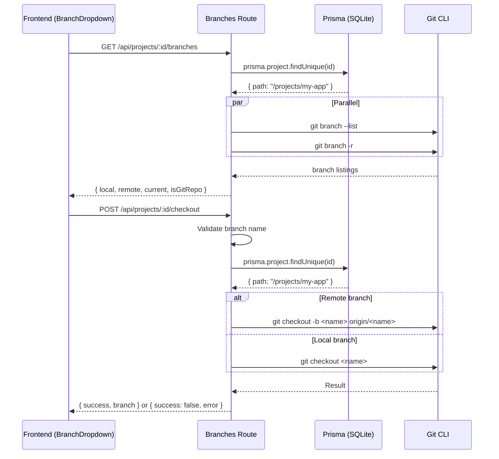

# Git Integration — Design Specification

## Overview

The Git Integration module provides backend APIs for listing and switching git branches within a project. It wraps `git` CLI commands via Node.js `child_process` and is used by the frontend's `BranchDropdown` component in the agent panel.

---

## Backend Design

### API Endpoints

| Method | Endpoint | Description |
|---|---|---|
| GET | `/api/projects/:id/branches` | List local and remote git branches |
| POST | `/api/projects/:id/checkout` | Switch to a specified branch |

### Endpoint Details

#### `GET /api/projects/:id/branches`

Lists all local and remote git branches for a project. Resolves the project's filesystem path from the database, then executes `git branch --list` and `git branch -r` in parallel.

**Response:**

```json
{
  "local": ["main", "feature/specs-page", "develop"],
  "remote": ["origin/main", "origin/feature/specs-page", "origin/develop"],
  "current": "feature/specs-page",
  "isGitRepo": true
}
```

| Field | Type | Description |
|---|---|---|
| `local` | string[] | Local branch names |
| `remote` | string[] | Remote tracking branches (excluding `HEAD ->` references) |
| `current` | string \| null | Currently checked-out branch (marked with `*` in git output) |
| `isGitRepo` | boolean | Whether the path is a valid git repository |

If the directory is not a git repo or git is unavailable, returns `{ local: [], remote: [], current: null, isGitRepo: false }`.

**Implementation:**

1. Look up project by ID via Prisma
2. Run `git branch --list` to get local branches (10-second timeout)
3. Run `git branch -r` to get remote branches (10-second timeout)
4. Parse the current branch (prefixed with `* ` in output)
5. Filter out symbolic refs (lines containing `->`)

#### `POST /api/projects/:id/checkout`

Switches the working directory to a specified branch. Supports both local branches and remote tracking branches (automatically creates a local branch when checking out a remote ref).

**Request Body:**

| Field | Type | Required | Description |
|---|---|---|---|
| `branch` | string | yes | Branch name to check out |

**Validation:**
- `branch` must be a non-empty string
- Must not contain null bytes or newlines (`/[\n\r\0]/` rejection)

**Response (success):**

```json
{
  "success": true,
  "branch": "feature/specs-page"
}
```

**Response (failure):**

```json
{
  "success": false,
  "error": "error: Your local changes to the following files would be overwritten by checkout..."
}
```

**Implementation:**

1. Look up project by ID via Prisma
2. Validate branch name (non-empty, no control characters)
3. Detect if branch is a remote ref (starts with `origin/`)
4. For remote branches: run `git checkout -b <localName> <remoteRef>`
5. For local branches: run `git checkout <branch>`
6. 10-second timeout on git operations
7. Return git's stderr on failure

### Data Flow



---

## Implementation Notes

- **No External Dependencies**: Uses Node.js built-in `child_process.execFile` (not `exec`) to avoid shell injection risks.
- **Timeout Protection**: All git commands have a 10-second timeout to prevent hanging on large repositories.
- **Branch Name Sanitization**: Control characters (`\n`, `\r`, `\0`) are rejected to prevent command injection.
- **Remote Branch Handling**: When checking out a remote branch like `origin/feature`, the system automatically strips the `origin/` prefix and creates a local tracking branch via `git checkout -b feature origin/feature`.
- **Graceful Degradation**: If the project directory is not a git repository, the branches endpoint returns empty arrays with `isGitRepo: false` rather than an error.
- **Project Resolution**: Both endpoints resolve the project's filesystem path from the database before executing git commands, ensuring operations target the correct directory.
