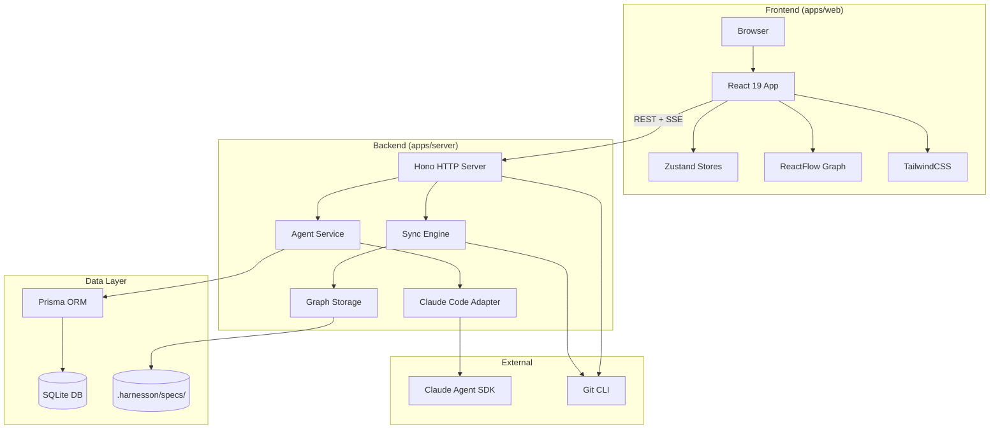

# Project Architecture Overview

## Monorepo Structure

Harnesson is a pnpm monorepo with three packages: a backend server, a frontend web app, and a shared types library.

```
harnesson/
├── apps/
│   ├── server/          # Backend — Hono + Prisma + SQLite + Claude Agent SDK
│   │   ├── prisma/
│   │   │   └── schema.prisma
│   │   └── src/
│   │       ├── index.ts
│   │       ├── routes/
│   │       │   ├── agents.ts
│   │       │   ├── branches.ts
│   │       │   ├── graph.ts
│   │       │   ├── health.ts
│   │       │   ├── open-folder.ts
│   │       │   └── projects.ts
│   │       └── lib/
│   │           ├── agent-adapter.ts
│   │           ├── agent-service.ts
│   │           ├── claude-code-adapter.ts
│   │           ├── find-port.ts
│   │           ├── graph-storage.ts
│   │           ├── native-dialog.ts
│   │           ├── prisma.ts
│   │           ├── slash-commands.ts
│   │           └── sync-engine.ts
│   └── web/             # Frontend — React 19 + Vite 6 + Zustand + ReactFlow + TailwindCSS
│       └── src/
│           ├── App.tsx
│           ├── main.tsx
│           ├── pages/
│           │   ├── ProjectsPage.tsx
│           │   ├── GraphPage.tsx
│           │   ├── TasksPage.tsx
│           │   ├── FilesPage.tsx
│           │   ├── GitPage.tsx
│           │   ├── NewSessionPage.tsx
│           │   └── NotFoundPage.tsx
│           ├── components/
│           │   ├── chat/
│           │   ├── graph/
│           │   ├── layout/
│           │   └── projects/
│           ├── stores/
│           │   ├── agentStore.ts
│           │   ├── graphStore.ts
│           │   ├── projectStore.ts
│           │   └── slashCommandStore.ts
│           ├── hooks/
│           └── lib/
└── packages/
    └── shared/          # Shared types (agent, graph, project, spec-node, task)
        └── src/
            ├── index.ts
            └── types/
                ├── agent.ts
                ├── graph.ts
                ├── project.ts
                ├── spec-node.ts
                └── task.ts
```

## Tech Stack

| Layer | Technology | Version | Purpose |
|---|---|---|---|
| Runtime | Node.js | 22+ | Server runtime |
| Package Manager | pnpm | workspace | Monorepo management |
| Backend Framework | Hono | ^4.7 | HTTP server & routing |
| ORM | Prisma | ^7.8 | Database access (client engine) |
| Database | SQLite (better-sqlite3) | ^12.9 | Embedded persistence |
| AI SDK | @anthropic-ai/claude-agent-sdk | ^0.2.126 | Agent orchestration |
| AI CLI | @anthropic-ai/claude-code | ^2.1.126 | Claude Code integration |
| Frontend Framework | React | ^19.0 | UI library |
| Build Tool | Vite | ^6.2 | Dev server & bundler |
| State Management | Zustand | ^5.0 | Client-side stores |
| Graph Visualization | @xyflow/react | ^12.10 | Node-edge graph rendering |
| Graph Layout | @dagrejs/dagre | ^3.0 | Automatic graph layout |
| Styling | TailwindCSS | ^4.1 | Utility-first CSS |
| Routing | react-router | ^7.4 | Client-side routing |
| Icons | lucide-react | ^0.475 | Icon set |
| Markdown | react-markdown + remark-gfm | ^10.1 / ^4.0 | Rich text rendering |
| Code Highlighting | prism-react-renderer | ^2.4 | Syntax highlighting |
| Testing | Vitest + Testing Library | ^4.1 | Unit & component tests |
| TypeScript | TypeScript | ^5.7 | Type safety across all packages |

## Architecture Diagram



## Key Modules

| Module | Location | Responsibility |
|---|---|---|
| **Projects Route** | `apps/server/src/routes/projects.ts` | CRUD for project records |
| **Agents Route** | `apps/server/src/routes/agents.ts` | Agent lifecycle, messaging, SSE streaming |
| **Agent Service** | `apps/server/src/lib/agent-service.ts` | Agent runtime management, session orchestration |
| **Claude Code Adapter** | `apps/server/src/lib/claude-code-adapter.ts` | Claude Agent SDK integration layer |
| **Graph Route** | `apps/server/src/routes/graph.ts` | Spec graph data, sync orchestration |
| **Graph Storage** | `apps/server/src/lib/graph-storage.ts` | File-based graph persistence (.harnesson/specs/) |
| **Sync Engine** | `apps/server/src/lib/sync-engine.ts` | Project scanning & spec generation |
| **Branches Route** | `apps/server/src/routes/branches.ts` | Git branch listing & checkout |
| **Project Store** | `apps/web/src/stores/projectStore.ts` | Client-side project state |
| **Agent Store** | `apps/web/src/stores/agentStore.ts` | Client-side agent/chat state |
| **Graph Store** | `apps/web/src/stores/graphStore.ts` | Client-side graph data state |
| **AgentPanel** | `apps/web/src/components/layout/AgentPanel.tsx` | Main agent chat UI |
| **GraphPage** | `apps/web/src/pages/GraphPage.tsx` | Multi-tab graph/spec viewer |
| **ProjectsPage** | `apps/web/src/pages/ProjectsPage.tsx` | Project list & creation |
| **Shared Types** | `packages/shared/src/types/` | Agent, Graph, Project, SpecNode, Task types |

## Data Model (Prisma)

```prisma
Project 1--* AgentSession 1--* Message
Project 1--* AgentSession 1--* TodoItem
```

- **Project**: id, name, path (unique), description, source, agentCount
- **AgentSession**: id, name, type, status, projectId, branch, worktreePath, cwd, model, permissionMode, config, sessionData
- **Message**: id, agentId, role, content, images (JSON), contentBlocks (JSON), events (JSON)
- **TodoItem**: id, agentId, subject, description, status, activeForm

## Communication Patterns

- **REST**: Standard request/response for CRUD operations
- **SSE (Server-Sent Events)**: Real-time agent stream events and sync progress
- **File-based Storage**: Graph/spec data persisted as JSON files in `.harnesson/specs/` within the project directory

## Development Scripts

| Command | Scope | Action |
|---|---|---|
| `pnpm --filter @harnesson/server dev` | server | Start dev server with tsx watch |
| `pnpm --filter @harnesson/web dev` | web | Start Vite dev server |
| `pnpm --filter @harnesson/server test` | server | Run Vitest tests |
| `pnpm --filter @harnesson/web test` | web | Run Vitest tests |
